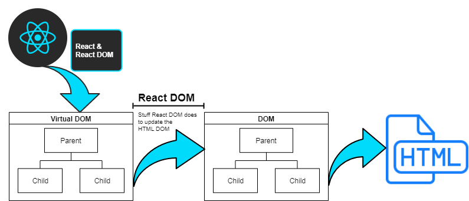

# react-development-guide

learning credit https://zerotomastery.io/, amazing explanations, and of course https://reactjs.org/docs/getting-started.html

> #### Project Goals
>
> - Learn to work on client application development with react
> - Explore the react basics, ui frameworks, state management, pwa capabilities, testing, mobile support, graphql, architectural concepts, workflows, etc.

## Why Does React Exist?

> the 'react robot' interacts with the DOM and makes changes for you

### Before React

- html, css, js
- Simple exchanges between server and client
- Problems managing adaptations among browser differences

### Birth of SPA

- Different system only loads app code once
- Apps act more like desktop app where js simple changes or updates dom w/out having to speak to the server
- Angularjs is created by google

### React released to dev community

- Facebook creates react architecture IOT handle complex applications
- Facebook releases react to the community in 2013
- Released while google was rewriting angularjs

## 4 React Concepts

### 1 Fundamentals: declarative vs. imperative

- Paradigm programming (explicitly writing everything) is too difficult to manage
- Manages DOM tree and API so you don't have to manually write things like `document.createElement()`
- Declarative approach, **declare how object looks**, one js object describes how app looks.
- Build web interface without touching the DOM
- React observes state object and **reacts** to what the object describes instead of the DOM being explicitly written

### 2 Components

- Components allow the practice of DRY
- Components created based on the state object and built as **functions**
- These functions can be added to the page like lego blocks

### 3 Unique directional data flow

- JSX passed to react library **IOT create VirtualDOM**
- VirtualDOM gives react a blueprint IOT update actual dom
- Data can only trickle down the pyramid
- State changes => determine how DOM is rendered
- This flow restricts helps with debugging

### 4 React is simply the UI

> Only a UI library the rest is up to the developer

## Summary

1. Don't touch DOM, react will
2. All about components and creation of our VirtualDOM
3. Data flows in one direction
4. UI only, react automates DOM manipulation

### The job of a react developer

1. Decide on components > how far do you break down a component
2. Decide where the **State** lives
3. What **changes** do we make when the State changes
