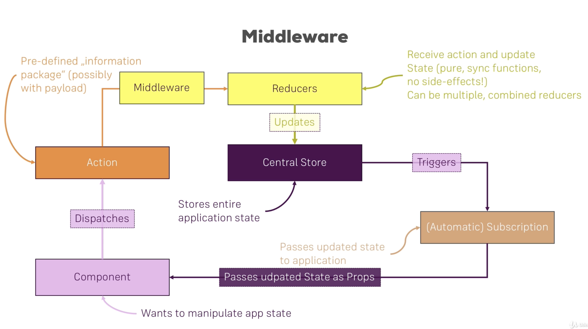

# React Sandbox

Use [the Playground](src/Playground/Playground.js) for working with concepts.

All components can be viewed together (eg. Playground, Composition, State) by running `npm start` in this `react_app_kbochanski` directory.

## Scribbles

* `props.<attr>` or `props.children` used to grab parent info
* `state` used to store current component info
* If `const personIndex = this.state.persons.findIndex(p => {return p.id === id;})` for an `onChange` handler, then since JS variables are references to objects, copy the object with a spread operator, eg. `const person = {...this.state.persons[personIndex]}.` You would then update state with `this.setState({persons:persons})`
* Also remember (to make it easy for React to know what to update) to give a component a `key` attribute (prob using the data primary key aka unique and not null)
* Use `map` to return a list of components
* Use something like `click={()=>this.deletePersonHandler(index)}` to call a function when you update state using component index for where you clicked.
* Use `lifecycle hooks` for calling pre-named functions in classes or `react hooks` for doing this in functions... aka an http request after a components load and needs to get the most recent data aka `componentDidMount(){}` or `componentDidUpdate(){}`. In a functional component just use `useEffect(()=> {console.log("I will execute for every render cycle")},[<list-of-props-for-which-useEffect-will-execute>])` (in virtual DOM). `[]` arg in `useEffect` to only run when component mounts/is first loaded.
* Can memoize functional components (analogous to `componentShouldUpdate()` for class based) via `export default React.memo(<component>)`
* Can use a `PureComponent` to automatically implement `shouldComponentUpdate` to check if `nextProps` are different that the current props.
* You CAN return adjacent JSX elements if they are in an array (needs to be an array and need a key for each component). Could also wrap with an empty wrapper/Aux component/HOC component from `const aux = props = => props.children;`. Or just use `React.Fragment`.
* Some HOCs aka Higher Order Components include eg. `export default withClass(App, classes.App)` where `withClass` adds some functionality to a component eg. `App`
* Can add props to a component with eg. `<component {...props}/>
* Can check types with `npm install prop-types`
* Can make a reference to a component via the attribute eg. `ref=` in a component. Useful for passing functions to components. With React Hooks, use eg. `const toggleBtnRef = useRef()`.
* If you want to skip passing props A -> B -> C -> D and do A -> D, use Context API. eg. `<AuthContext.Provider>` and `<AuthContext.Consumer>` where the context component is basically a JS object that just gets the state from A and provides for D. An alternative pattern for classes is `static contextType = AuthContext` or for hooks is eg. `const authContext =  useContext(AuthContext)`. Seems to be basis of `redux`
* Http/Ajax Requests
  * use axios for RESTful requests. You can make an instance of axios to give different objects different headers, etc. `instance = axios.create(baseURL:'lkdkfjdf')`
* Forms
  * Form validation can be difficult in react because??
  * Not sure why 
  * Could use JS Config (a js object) to validate/make a form ... idk. I think it makes it easier to update the form in the long run. Seems like forms are pretty diy/do it yourself approach... prob good for customizability see [here](https://www.udemy.com/course/react-the-complete-guide-incl-redux/learn/lecture/8172862#overview) for some resources... still not sure exact use cas of a form over just editable text areas or something
  * For managing state, should prob use redux, a big javascript object useful for holding state
    * Use `array.concat()` to add elements to a copy of an array (immutably update state)
    * Use `array.filter(result => result.id !== anotherId)` to remove anotherId
    * Just make sure to do deep copies of array if nested
    * See more immutable update patterns at https://redux.js.org/recipes/structuring-reducers/immutable-update-patterns/
    * Definitely a bunch of similar concepts to Vuex store
    * Basically you call an action type which calls a function that mutates the store immutably
    * Usually helps to split up a reducer by feature then reducer combined behind the scenes aka make a reducer folder
    * Don't use redux for state like
      * **local UI** state eg. a modal
    * Use redux for state like
      * **persistant state** eg. user posts (but don't put entire database in store, just relevant slices)
      * **client state** eg. authenticated or filters
* Middleware - can use [Redux DevTools](https://github.com/zalmoxisus/redux-devtools-extension) from Chrome Store for developing
  * Functions you hook into a process eg. logging something or other async code
  * Want to use Action Creators for async code and fine for sync code. eg. a function in action.js that is dispatched.. not sure how it relates to store changing
    * Use [redux-thunk](https://github.com/reduxjs/redux-thunk) to use an action that is a function that will be called later (does not return action itself)
    * Put *data transforming* logic in action creator. Thus *action* does something to the data, *dispatch* changes store or maybe triggers the action?? The *reducer* stores the value in the state (immuteably). Since reducers can't run async code, maybs use Action Creators for just async code then transform in Reducer. 
  * eg. a function like
  ```js
  const logger = store => {
      return next => {
          return action => {
              console.log('[Middleware] Dispatching', action);
              const result = next(action);
              console.log('[Middleware] next state', store.getState());
              return result;
          }
      }
  }
  ```
See 
* React Hooks
  * `useState()` is most important hook for giving state for functions
    * eg. using array destructering `const [enteredVal, setEnteredVal] = useState('');`
    * Then could do `const addValHandler = val = { setEnteredVal(prevVals => [...prevVals, newVal])}`
    * Then can pass this function from root component to children to update state

* Component Deep Dive (**Section 7**)
* State Management. 
  * `class` based is the standard
  * `redux` - See (**Section 14** and **Section 16** (adv) and **Section 25** (saga) for `redux`
  * `hooks` - See **Section 26** and **Section 28** for functional based React `hooks` that would replace `redux` and classes (and lifecycle methods/hooks) for state management.
* Finish Basic Burger project after working with React more (**Section 8**, **Section 10** for http requests, **Section 12** for routing, **Section 15 and 17** for redux, **Section 19** for improvements, **Section 27** for `hooks`)
* Should look at Axios section for HTTP requests when the app is working pretty well (**Section 9**)
* Should look at the routing at some point for multi-page app simulation (**Section 11**)
* Should look at forms and form validation (**Section 13**)
* Should look at authentication (**Section 18**)
* Should look at testing and deployment (**Section 20** and **Section 21**)
* Should look at Webpack and Next.js (**Section 22** and **Section 23**)
* Styling (**Section 5** and **Section 24** for Animation and **Section 29** for extra stuff)


It looks like the basic structure of a react app is similar to Vue.js in terms of general set-up. Not sure about Angular. You want to only render ONE root component for your app as the React DOM. Then include all other components in that app. Similar to the `main` class calling all other classes. You always `return` jsx which is code that looks like `.html` in a js function. Essentially, jsx uses `React.createElement('div',<js object>,<child element>)`. jsx is just cleaner than using nested `.createElement` methods. React is really just a library for creating components in its core.

Some catches;
* Can't use `class` in jsx since a reserved word. Change to `className`
* A component is simply a function that returns some jsx
* Best practice is to use ES6, not ES5.
* Watch the *Flexible Lists* video for best practices on mutating js objects (don't want to update directly since variables are simply pointers to the object).


Some good practices;
* Give components an Uppercase name.
* Try to use functional (not class-based components.. which save state.. and are called containers) as much as possible
* You can also save state in a functional component using react hooks.
* You want to create **as many** stateless components as possible! Many stateful components can make an app harder to manage since many places to change when changing how data is dealt with.
* Usually use the key (prob primary key) in data to update specific chunks of data.
* Render methods should not include too much jsx. Just variables for higher level project structure.
* Use folders to organize structure (eg. creating `containers` and `components` folder)
* It seems like it may be best to use a custom react `hook` for state management buuutttt is is most common for apps to use class based (by component) or redux (global) state management. See [this article](https://reactjs.org/docs/hooks-intro.html) for info about how hooks solve many problems of class-based apps and the migration toward them.
* [This guide](https://reactjs.org/docs/composition-vs-inheritance.html) has a bunch of useful practical tips on aspects of React
* For styling prob best to use [CSS Modules](https://create-react-app.dev/docs/adding-a-css-modules-stylesheet/) which allow you to link a `.css` file directly to a component.
* By the way, if you somehow also want to define a global (i.e. un-transformed) CSS class in such a `.css`  file, you can prefix the selector with `:global` . eg . `:global .Post { ... }`. Now you can use `className="Post"`  anywhere in your app and receive that styling.

Some observations;
* Looks like `redux` is **very** similar to `vuex` in terms of managing state with dispatch methods, actions, etc (overall calls to global state and component subscriptions)... not sure how the `react hooks` method for state management (with functional components is different/works). Benefits of not using `redux` and `hooks` instead would be;
  * You ship less code
  * You don't have to learn `redux` (although not that hard)
  * You don't have to pass state through components (using class based state management)
* Another approach is the *Context API*. Not good for all use cases. This is done via a context js function and the `useContext` hook. Every component that uses context though will rerender so not good for global state management.
* For `hooks` solution to global state management, just make a folder named `store` like for `redux`
  * Make an object `let globalState = {};` and `let listeners = [];` and `let actions = [];`
  * Build custom hook
  * Looks like the `hook` method is actually really similar to the `redux` state management method. You just write the store with a custom hook where you deine variables defined **once** for the life of the application. You then manage "slices" of the global state.
  * Notes on [closures](https://developer.mozilla.org/en-US/docs/Web/JavaScript/Closures)
  * [React Chrome DevTools](https://developers.google.com/web/tools/chrome-devtools/javascript/) is helpful when debugging code in browser. To gracefully handle errors, you can use an *Error Boundary* component. You can also just step through functions in the Chrome Inspector Sources tab using the built-in debugger.

## Planning Your Application


1. Component Tree/Component Structure
   1. Part of this involves drawing (on paper or some sketch service what you want the app to visually look like)
2. Application State (Data)
3. Components versus Containers
   1. Which components should be stateless and which should be stateful?
4. [This](https://reactjs.org/docs/thinking-in-react.html) article from React is a good reference.

## Working with Lists and Conditionals

This allows you to integrate control flows into your app.
* Sounds like you can't use `if` statements in jsx. Have to use ternary expressions. eg. `boolean ? if true expression : if false expression`.
* It is best, however to just use an `if` statement in js section and `return` jsx with the js `let <var>` included.

## Better Project Structure


## The below was created from `create-react-app` bootstrapping.

This project was bootstrapped with [Create React App](https://github.com/facebook/create-react-app).

## Available Scripts

In the project directory, you can run:

### `npm start`

Runs the app in the development mode.<br />
Open [http://localhost:3000](http://localhost:3000) to view it in the browser.

The page will reload if you make edits.<br />
You will also see any lint errors in the console.

### `npm test`

Launches the test runner in the interactive watch mode.<br />
See the section about [running tests](https://facebook.github.io/create-react-app/docs/running-tests) for more information.

### `npm run build`

Builds the app for production to the `build` folder.<br />
It correctly bundles React in production mode and optimizes the build for the best performance.

The build is minified and the filenames include the hashes.<br />
Your app is ready to be deployed!

See the section about [deployment](https://facebook.github.io/create-react-app/docs/deployment) for more information.

### `npm run eject`

**Note: this is a one-way operation. Once you `eject`, you can’t go back!**

If you aren’t satisfied with the build tool and configuration choices, you can `eject` at any time. This command will remove the single build dependency from your project.

Instead, it will copy all the configuration files and the transitive dependencies (webpack, Babel, ESLint, etc) right into your project so you have full control over them. All of the commands except `eject` will still work, but they will point to the copied scripts so you can tweak them. At this point you’re on your own.

You don’t have to ever use `eject`. The curated feature set is suitable for small and middle deployments, and you shouldn’t feel obligated to use this feature. However we understand that this tool wouldn’t be useful if you couldn’t customize it when you are ready for it.

## Learn More

You can learn more in the [Create React App documentation](https://facebook.github.io/create-react-app/docs/getting-started).

To learn React, check out the [React documentation](https://reactjs.org/).

### Code Splitting

This section has moved here: https://facebook.github.io/create-react-app/docs/code-splitting

### Analyzing the Bundle Size

This section has moved here: https://facebook.github.io/create-react-app/docs/analyzing-the-bundle-size

### Making a Progressive Web App

This section has moved here: https://facebook.github.io/create-react-app/docs/making-a-progressive-web-app

### Advanced Configuration

This section has moved here: https://facebook.github.io/create-react-app/docs/advanced-configuration

### Deployment

This section has moved here: https://facebook.github.io/create-react-app/docs/deployment

### `npm run build` fails to minify

This section has moved here: https://facebook.github.io/create-react-app/docs/troubleshooting#npm-run-build-fails-to-minify


